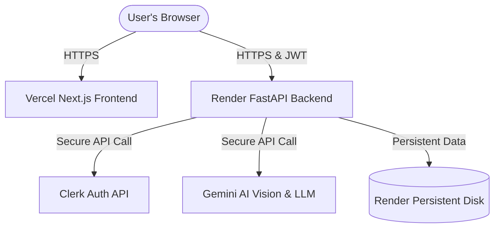

# 🚀 Production Deployment Guide

This guide provides step-by-step instructions for deploying the **Construction Report Aggregator** to production.

- **Frontend**: Next.js App deployed to **Vercel**
- **Backend**: FastAPI App deployed to **Render**

---

## 🏗️ Architecture Overview



---

## 🌐 1. Backend Deployment (Render)

Render is ideal for deploying FastAPI applications. We will configure it as a **Web Service** with a **Persistent Disk** to ensure report downloads and SWOT cache files are retained between redeployments.

### Step 1: Create a New Web Service
1. Connect your GitHub repository to Render.
2. Select the repository and choose **Web Service**.
3. Set the following basic parameters:
   - **Name**: `report-aggregator-backend`
   - **Runtime**: `Python 3`
   - **Root Directory**: `backend` *(Critical: This points Render directly to the Python workspace)*
   - **Build Command**: `pip install -r requirements.txt`
   - **Start Command**: `uvicorn main:app --host 0.0.0.0 --port $PORT`

### Step 2: Configure Environment Variables
In the **Environment** tab of your Render Web Service, add the following variables:

| Variable Name | Description | Example / Recommended Value |
| :--- | :--- | :--- |
| `PYTHON_VERSION` | Forces Render to use a stable Python environment (avoids build errors) | `3.11.9` |
| `GOOGLE_CREDENTIALS_JSON` | Primary Google Service Account JSON string (Vertex AI access) | `{"type": "service_account", ...}` |
| `GOOGLE_CREDENTIALS_JSON_2` | Secondary Google Service Account JSON string (Optional, for load balancing) | `{"type": "service_account", ...}` |
| `ADMIN_EMAIL` | The designated administrator email address | `--@_mail.com` |
| `CLERK_SECRET_KEY` | Clerk backend API key for fetching user info | `sk_test_...` |
| `CLERK_JWKS_URL` | Clerk JWKS endpoint to retrieve signature verification keys | `https://your-clerk-instance.clerk.accounts.dev/.well-known/jwks.json` |

> [!NOTE]
> Ensure that `GOOGLE_CREDENTIALS_JSON` (and optionally `GOOGLE_CREDENTIALS_JSON_2` for load balancing) are properly configured as environment variables in Render production. The backend application authenticates to Google Vertex AI via Service Account OAuth2 credentials, and does not use direct `GEMINI_API_KEY` developer keys.

### Step 3: Attach Persistent Storage (Recommended)
Since the backend compiles reports, summaries, and correspondence into files under `backend/cache` and `backend/temp_uploads`, deploying on a standard ephemeral server means files are deleted on restarts.
1. Go to the **Disk** section in Render.
2. Click **Add Disk**.
3. Set the following properties:
   - **Name**: `cache-volume`
   - **Mount Path**: `/opt/render/project/src/backend/cache` *(If Root Directory is empty)* or simply `cache` *(If Root Directory is set to `backend`)*
   - **Size**: `1 GiB` (minimum is plenty)

---

## 🎨 2. Frontend Deployment (Vercel)

Vercel is the native platform for Next.js, optimizing builds and edge rendering automatically.

### Step 1: Create a New Project
1. Log in to Vercel and import your repository.
2. Configure the following project parameters:
   - **Framework Preset**: `Next.js`
   - **Root Directory**: `frontend` *(Critical: This points Vercel directly to the Next.js app)*

### Step 2: Configure Environment Variables
In the project settings, add the following **Environment Variables**:

| Variable Name | Description | Recommended Value |
| :--- | :--- | :--- |
| `NEXT_PUBLIC_BACKEND_URL` | Production URL of your Render backend | `https://report-aggregator-backend.onrender.com` |
| `NEXT_PUBLIC_ADMIN_EMAIL` | Designated Admin Email (matches backend) | `dennis.cmuhnene@gmail.com` |
| `NEXT_PUBLIC_CLERK_PUBLISHABLE_KEY` | Clerk frontend publishable key | `pk_test_...` |
| `CLERK_SECRET_KEY` | Clerk backend secret key | `sk_test_...` |
| `NEXT_PUBLIC_CLERK_SIGN_IN_URL` | Clerk Redirect sign-in path | `/login` |
| `NEXT_PUBLIC_CLERK_SIGN_UP_URL` | Clerk Redirect sign-up path | `/login` |

### Step 3: Trigger Build
Click **Deploy**. Vercel will build the frontend, optimize visual structures, and serve the application globally.

---

## 🔒 3. CORS & Authentication Verification

### High-Fidelity Bearer Token flow
We have verified that `backend/main.py` is configured with:
```python
app.add_middleware(
    CORSMiddleware,
    allow_origins=["*"],
    allow_methods=["*"],
    allow_headers=["*"],
)
```
- **Why this works**: By setting `allow_origins=["*"]` without credentials, Vercel can securely communicate with Render. Since the frontend passes all JWT tokens inside the `Authorization: Bearer <token>` header (rather than using cookies), the browser will **never** block requests due to cross-origin resource sharing policies.
- **Clock Skew Cushion**: The backend token verification incorporates a `120s` leeway buffer. This shields your production server from minor clock discrepancies between Clerk's servers and Render's instances, preventing random `401 Unauthorized` errors.
